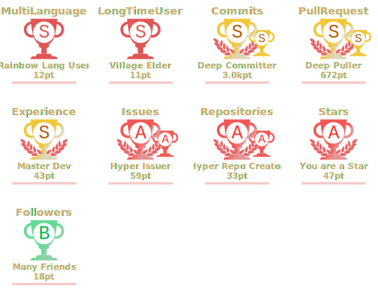

<link rel="stylesheet" href="./assets/style.css">

Hi  My name is Mohammad Mohammad Hasan
===============================================================================================================================================

Senior Software Engineer (Backend & Platform)
-----------------

> Organized & dependable with analytical and result driven mindset. Dedicated to achieve demanding objectives _with proven troubleshooting and debugging capabilities_ for complex technical issue resolution.

* 🌍  I'm based in Dhaka, Bangladesh
* 🖥️  See my portfolio at [LinkedIn](http://www.linkedin.com/in/abmmhasan/)
* ✉️  You can contact me at [LinkedIn](http://www.linkedin.com/in/abmmhasan/)
<!-- * 🚀  I'm currently working on [Dtac App/Lite API](https://www.dtac.co.th), [ATOM App API](https://www.atom.com.mm) -->
* 🤝  I'm open to collaborating on Libraries, Frameworks, RESTful APIs
* ⚡  I prefer code to be lightweight, updated, least complex and balanced within Speed & Scalability

### Skills
<table border="0" cellpadding="0" cellspacing="0">
  <tr>
    <td border="0"></td>
    <td border="0"></td>
    <td border="0"></td>
    <td border="0"></td>
    <td border="0"></td>
    <td border="0"></td>
    <td border="0"></td>
    <td border="0"></td>
    <td border="0"></td>
  </tr>
  <tr>
    <td border="0"></td>
    <td border="0"></td>
    <td border="0"></td>
    <td border="0"></td>
    <td border="0"></td>
    <td border="0"></td>
    <td border="0"></td>
    <td border="0"></td>
  </tr>
</table>

`Key Expertise:` Algorithm Implementation, Virtualization, System Optimization, Technical Analysis, Cryptographic Security, DevOps

`Programming Languages:` PHP, JavaScript (Basic), HTML5 (Basic), Bash

`Databases:` PostgreSQL, MySQL, MariaDB, Redis, ElasticSearch, MongoDB

`Platforms & Tools:` Apache, Nginx, Laravel, Docker, Jenkins, Git, Jira

`Security & Architecture:` Multi-Factor Authentication, API Development, Cross-Platform System Design, Cybersecurity, RESTful Services, Service-Oriented Architecture

`Testing & Automation:` Performance Optimization, System Automation, Secure File Handling, ETL Pipelines, Agile Project Management

### Find me

### Latest from my blog
<!-- BLOG-POST-LIST:START -->
- [Secrets Management: A Practical Guide from Cloud Native to GitOps](https://blog.infocyph.com/secrets-management-a-practical-guide-from-cloud-native-to-gitops-3a9c9c4072d0?source=rss-90c9434afd1------2)
- [Free Git Clients: The better ones](https://blog.infocyph.com/free-git-clients-the-better-ones-db63c47949eb?source=rss-90c9434afd1------2)
- [AI Can Write Code, But &lpar;Can&rpar; You?](https://blog.infocyph.com/ai-can-write-code-but-can-you-3b1a81f81a1a?source=rss-90c9434afd1------2)
- [Free Database Clients: The better ones](https://blog.infocyph.com/free-database-clients-the-better-ones-8a7dfaa78b40?source=rss-90c9434afd1------2)
- [The Definitive PHP-FPM Configuration Guide](https://blog.infocyph.com/the-definitive-php-fpm-configuration-guide-b6379b6a838b?source=rss-90c9434afd1------2)
<!-- BLOG-POST-LIST:END -->

[:book: Check my blog for more!](https://medium.com/@abmmhasan)

<picture>
  
</picture>

### Stats
<picture>
  
</picture>
<picture>
  
</picture>

<picture>
  
</picture>
<picture>
  
</picture>

[//]: # (### Special thanks)

[//]: # ()
